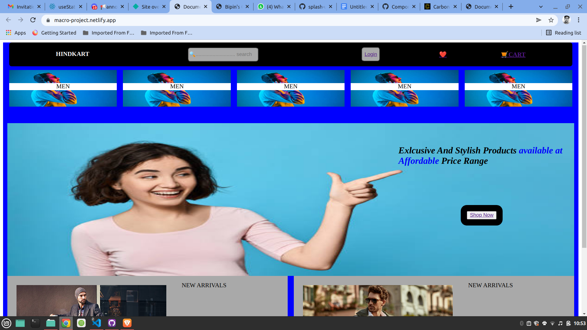

# macro-project
 This is a simple E-Commerce website created using just html and css
 
 ## Teachnologies Used :
 - HTML 
 - CSS

 # Home Page Preview :
 
 
 ## Available Components:
 - [login Page](https://macro-project.netlify.app/login/login.html)
 - [Sign-up Page](https://macro-project.netlify.app/sign-up/signup.html)
 - [wishlist Page](https://macro-project.netlify.app/wishlist%20page/wishlist.html)
 - [cart Page](https://macro-project.netlify.app/cart%20page/cart.html)
 - [home Page](https://macro-project.netlify.app/)
 

## Author: [Bipin Yadav](https://github.com/bipin7yadav)

 
